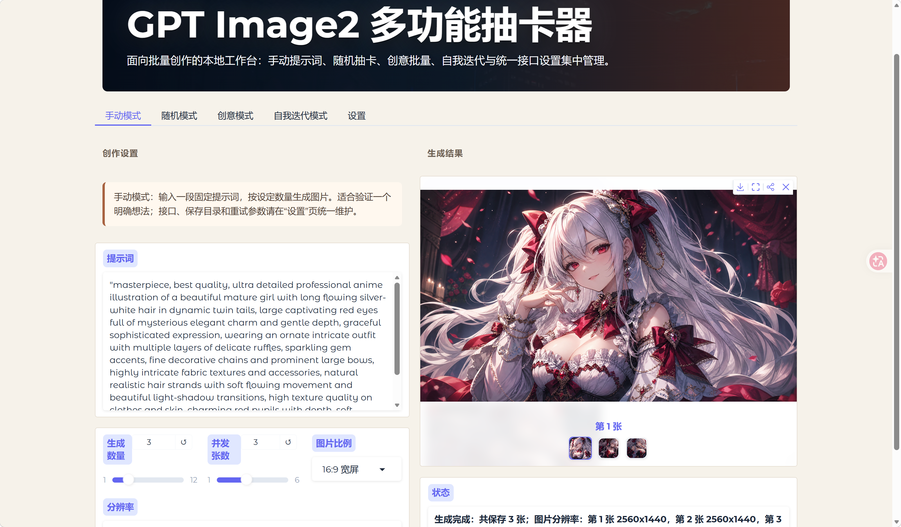
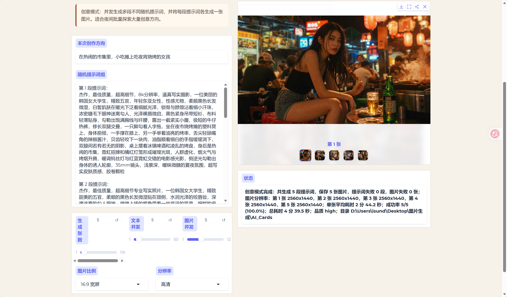
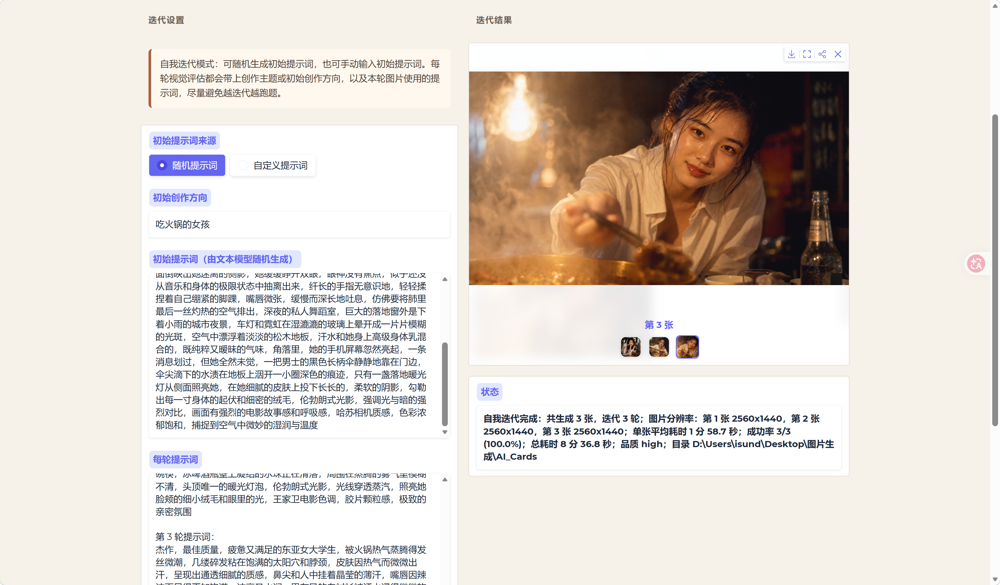

# GPT Image2 多功能抽卡器

一个面向 GPT Image 2 / OpenAI Images 兼容接口的本地图像生成工作台。它把提示词创作、批量出图、随机创意、多轮视觉迭代和图片提示词反推整合在一个 Gradio 界面里，适合需要更细粒度控制图片数量、比例、分辨率和并发流程的用户。

## 为什么做这个工具

很多 API 中转站已经提供了 GPT Image 2 或类似图片生成模型的接口，但常见 AI 聊天软件对图片生成参数的支持并不完整，例如不方便设置生成数量、比例、分辨率，也缺少批量生成、随机生成和自动迭代能力。

这个应用就是为这些场景设计的：通过一个本地可运行的界面，把图片接口、文本模型和多模态模型串起来，让普通用户也可以更灵活地做图像创作实验。

本项目由非程序员用户在 Codex 和 GPT-5.5 的帮助下完成，代码主要由 AI 自动生成。欢迎感兴趣的用户克隆、修改、继续改进。

## 功能亮点

- **手动模式**：输入固定提示词，选择数量、比例和分辨率后批量生成。
- **随机模式**：调用文本模型生成一段随机提示词，再用这段提示词生成多张图片。
- **创意模式**：同时生成多段不同随机提示词，并以可控并发流水线出图。
- **自我迭代模式**：生成图片后调用多模态模型进行视觉评估，自动返回优化提示词进入下一轮。
- **提示词反推**：上传图片或填写本地图片路径，由多模态模型反推出中文图像提示词。
- **统一设置页**：集中管理图片生成接口、文本模型接口、多模态模型接口、重试策略、保存目录和提示词模板。
- **协议适配**：支持 OpenAI Chat、OpenAI Responses、Gemini 原生协议、Claude Messages。
- **思考档位**：文本模型和多模态模型可以分别设置思考强度，并自动映射到不同厂商的参数。
- **图片压缩**：发送给多模态模型前自动压缩图片，降低上传体积，提高评估速度。
- **错误提示与重试**：接口报错、连接断开、重试状态会显示在状态栏中。

## 界面预览

### 手动模式

输入固定提示词，选择数量、比例、分辨率和并发张数后批量生成。



### 随机模式

由文本模型先生成一段随机提示词，再用这段提示词出图。


### 创意模式

并发生成多段不同提示词，并把每段提示词各生成一张图片。



### 自我迭代模式

生成图片后交给多模态模型评估，再返回优化提示词进入下一轮。



## 新手快速开始

下面以 Windows 为例，不需要写代码。

### 第 1 步：下载项目

打开本项目 GitHub 页面，点击右上方绿色按钮：

```text
Code -> Download ZIP
```

下载完成后，右键解压到一个你容易找到的位置，例如：

```text
D:\gpt-image2
```

### 第 2 步：安装 Python

如果电脑还没有 Python，去 Python 官网下载安装：

```text
https://www.python.org/downloads/
```

安装时建议勾选：

```text
Add python.exe to PATH
```

安装完成后，按 `Win + R`，输入 `cmd`，打开命令行，输入：

```bash
python --version
```

能看到版本号即可。

### 第 3 步：安装依赖

进入项目文件夹，在地址栏输入 `cmd` 并回车，打开当前目录的命令行。

然后输入：

```bash
pip install -r requirements.txt
```

等待安装完成。

### 第 4 步：启动应用

方式一：双击项目里的：

```text
启动.bat
```

方式二：在命令行输入：

```bash
python app.py
```

启动后会自动打开浏览器。如果没有自动打开，可以查看命令行里的本地地址，通常是：

```text
http://127.0.0.1:7860
```

### 第 5 步：填写接口设置

进入页面后打开“设置”页。

至少需要填写“图片生成接口”：

- API 地址
- 模型 ID
- API Key

如果要使用随机模式或创意模式，还需要填写“文本模型接口”。

如果要使用自我迭代或提示词反推，还需要填写“多模态模型接口”。

填写完成后点击：

```text
保存设置
```

然后回到对应模式开始使用。

### 常见问题

如果刷新页面后设置看起来没有更新，点击“重新读取设置”。

如果启动失败，通常是依赖没有安装成功，可以重新运行：

```bash
pip install -r requirements.txt
```

如果图片接口请求经常断开，可以降低图片并发数量，或者检查代理软件是否影响长连接。

## 接口说明

### 图片生成接口

用于实际生成图片。通常需要 OpenAI Images 兼容接口。

建议输入格式：

```text
https://example.com
```

或完整接口：

```text
https://example.com/v1/images/generations
```

### 文本模型接口

用于随机提示词生成和创意模式提示词生成。

支持：

- OpenAI Chat Completions
- OpenAI Responses
- Gemini 原生协议
- Claude Messages

### 多模态模型接口

用于自我迭代视觉评估和提示词反推。

支持：

- OpenAI Chat Completions
- OpenAI Responses
- Gemini 原生协议
- Claude Messages

## 思考档位

文本模型和多模态模型都可以单独设置：

```text
关闭 / 低 / 中 / 高 / 最高
```

程序会根据协议自动映射：

- OpenAI Chat：`reasoning_effort`
- OpenAI Responses：`reasoning.effort`
- Gemini：`thinkingConfig`
- Claude：`thinking` 或 adaptive thinking

如果某个接口不支持思考参数，选择“关闭”即可。

## 图片压缩

自我迭代和提示词反推会在发送图片给多模态模型前创建一份内存中的压缩 JPEG：

- 不影响本地保存的原图
- 默认长边限制为 1536px
- 默认 JPEG 质量为 90

这样可以明显减少多模态请求体积。

## 配置文件

首次保存设置后，程序会生成：

```text
app_config.json
```

它用于保存接口地址、模型 ID、保存目录、重试设置和提示词模板。可以参考：

```text
app_config.example.json
```

## 目录说明

```text
app.py                    主程序
config_store.py           配置读写工具
requirements.txt          Python 依赖
DEPENDENCIES.md           依赖说明
app_config.example.json   配置示例
启动.bat                  Windows 启动脚本
```

## 参与改进

欢迎提交 issue、建议或改进版本。可以继续扩展的方向包括：

- 更多图片生成协议
- 更细的任务队列管理
- 更灵活的提示词模板系统
- 更强的批量结果筛选和收藏
- 多模型对比生成
